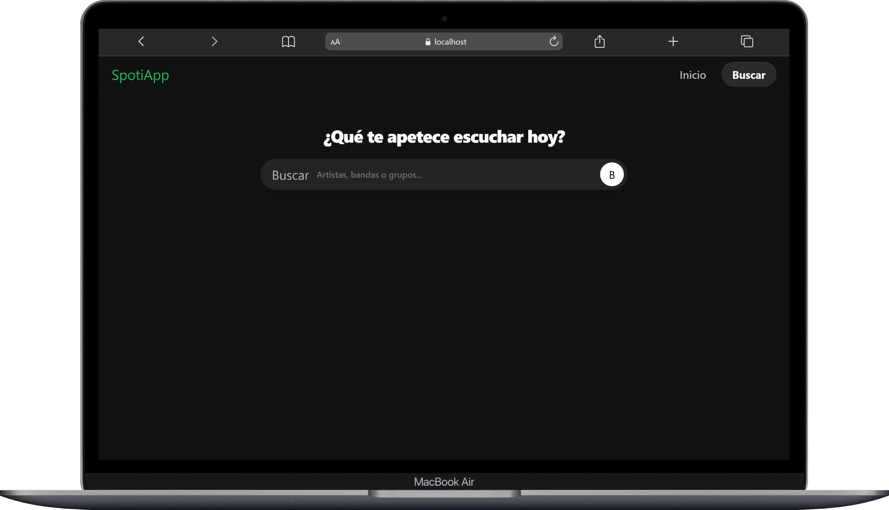
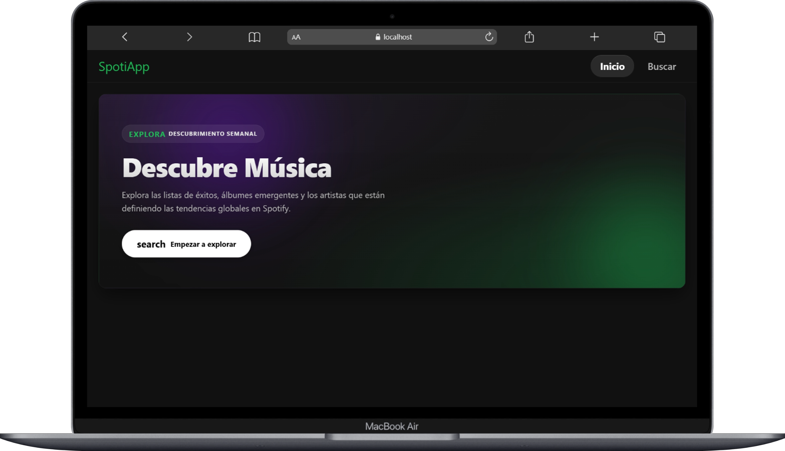

# Spotify Angular App

Aplicación desarrollada con Angular para búsqueda de artistas utilizando Spotify Web API.

---

## Tecnologías utilizadas

- Angular
- TypeScript
- RxJS
- HttpClient
- Bootstrap

---

## Características

- Búsqueda de artistas
- Visualización de información del artista
- Consumo de APIs REST
- Manejo de observables con RxJS
- Integración con Spotify Web API

---

## Capturas

### Vista principal

<p align="center">
  
</p>

---

### Vista responsive

<p align="center">
  
</p>

---

### Resultado de búsqueda

<p align="center">
  
</p>

---

## Importante

Spotify actualmente requiere:

- Cuenta Spotify Premium
- Token válido de acceso
- Renovación manual del token aproximadamente cada 1 hora

Por motivos de seguridad el token no se incluye en el repositorio.

Debe agregarse manualmente en:

```bash
src/app/services/spotify.service.ts
```

---

## Generar token Spotify

1. Crear aplicación en Spotify Developer Dashboard
2. Obtener Client ID y Client Secret
3. Generar access token utilizando OAuth Client Credentials Flow

---

## Instalación

Clonar repositorio:

```bash
git clone https://github.com/TU_USUARIO/spotify-angular-app.git
```

Instalar dependencias:

```bash
npm install
```

Ejecutar proyecto:

```bash
ng serve -o
```

---

## Estado del proyecto

Proyecto educativo enfocado en:

- Consumo de APIs REST
- Manejo de autenticación Bearer Token
- Integración Angular + RxJS
- Manejo de observables y peticiones HTTP
